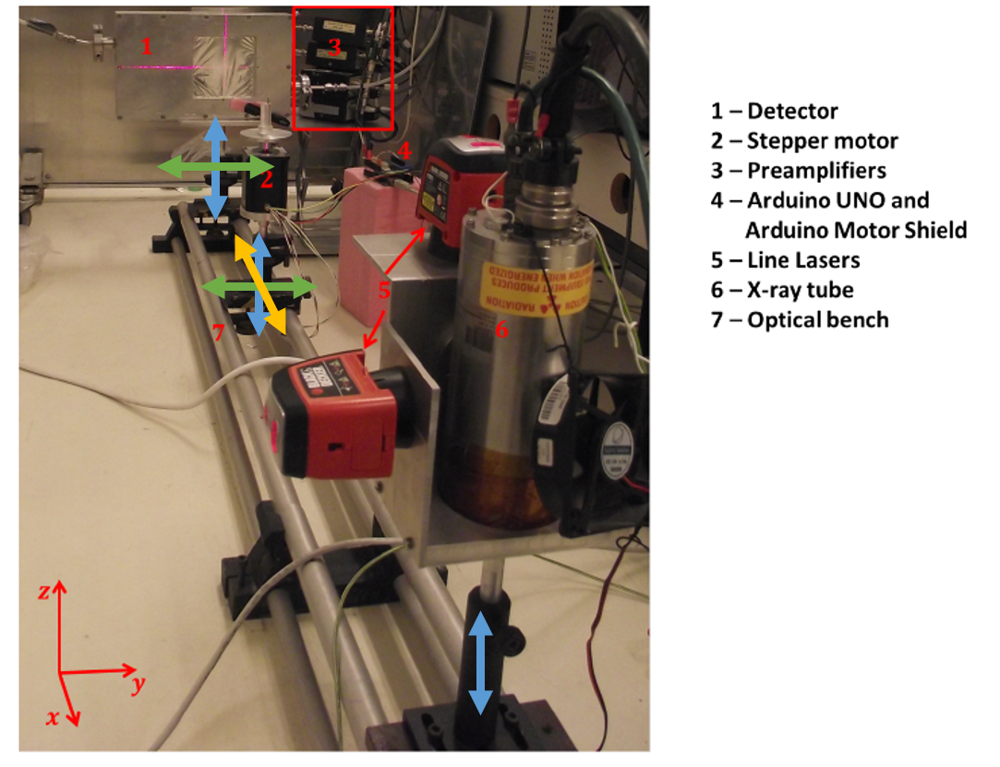

# Portofolio

Hello! Oi! Holla! Salut! I'm thrilled to present to you my portfolio, showcasing my journey and expertise in the realms of biomedical engineering (mechatronic systems development) and process engineering. Within this repository, you'll find detailed insights into three significant projects that highlight my skills and experiences:

## Development of a Mechanical System for a Computed Tomography Scan

 RESUME - X-ray imaging is currently essential in the daily life of many areas of health intervention (such as medicine and biomedical research). Recently, many progresses have been achieved in rays-X detectors functionalities and construction. These rays-X detectors are key parts of medical imaging techniques. The spectral detectors, for example, have increased the efficiency of medical images. At the University of Aveiro, the DRIM laboratory have contributed to the development of new spectral detectors. A computed tomography system is currently under development, which requires a robust and precisely aligned mechanical system to ensure good image quality. The aim of this project was to study and develop a mechanical support system for the components of the imaging system. The image system of CT is constituted by an X-ray tube, a gas detector, and a sample support. Each component mentioned needs to be held by a mechanical support with specific movements. The X-ray tube support must sustain 5.0 kilograms and move the tube until 10 centimetres in the y-axes and 15 centimetres in the z-axes. The detector support must sustain 10.0 kilograms and move the tube until 10 centimetres in the y-axes and 15 centimetres in the z-axes. Finally, the sample support must sustain 1.0 kilograms and move the tube until 1.0 metres in the x-axes and 15 centimetres in the z-axes. To build up such mechanical system was taken resorted of the potentialities of SOLIDWORKS & CAD modulation. Followed by a market materials study and purchase. After getting these materials it was used the machinery available at the mechanical and physics departments of the University of Aveiro to work these materials. With these steps achieved was possible to set up, partially, the desirable mechanical system for a CT scan. 

*CT Mechanical Support System available at DRIM laboratory in University of Aveiro*

*(A) SolidWorks 3D design improved assembly of CT mechanical system proposed. (B) SolidWorks 3D design improved assembly of CT mechanical system proposed with each support at its maximum length where is verified the alignment between them.*

*CT Mechanical System initial installation in a Mechanical Department lab at University of Aveiro with components bought to specific suppliers.*

## Development of an Automatic System for Behavior Analysis of Orthodontic Loops

RESUME - Orthodontic systems, including brackets and aligners, have gained significant popularity for dental correction. Countered orthodontic loops are typically employed in these devices to optimize the treatment of misaligned teeth. A manual mechanical device was previously created to measure the force and moment generated during loop deformation in various levels of pre-activation. This creative option urges as a tryout to rectify the lack of solutions to aid orthodontic loop countering. This work aimed to improve it to an automated solution that stimulates gingival/occlusal pre-activations and stores forces and moments generated. Firstly, a CAD modeling was created for a new proposed solution. Then, materials and components were meticulously selected to achieve this, and detailed technical drawings were created to fabricate some parts using a Computer Numerical Control (CNC) machine. The new system is powered by stepper motors and uses load cells to sense force and moments of loop ends, both controlled by an Arduino-Python interface. To the purpose goal, rigorous testing and system trials assess the correlation between force and moment for each end loop activation. Moving forward, the aim is to solve friction errors, conduct more complete tests, and collaborate with the esteemed Faculty of Dental Medicine at the University of Porto to scrutinize the outcomes. This project is believed to represent a vital contribution to addressing the need for more standard, efficient, and low-cost tools for orthodontic analysis.

Once all the system components are collected, they are assembled based on the latest SolidWork modeling. The final model and resulting product are shown and described in the figures below.

*Lateral view of final assembly designed, which function is imposing vertical and horizontal activations in α along gingival plane and tips activations along occlusal pane in β end loop.*

*Experimental assembly of mechanical parts; final mechanical assembly and its principal components identification; B. T-loop ends identification; C. system top view.*

### A - Arduino Code
[Open the following Paste](./arduino_code.ino/) to check the Arduino code used for motor and load cells control.
### B - Python Code
[Open the following Paste](./python_code.py/) to check the python interface designed using tkinter package. The interface communicate with Arduino and stires values of the motors and sensors embedded in the mechatronics system.

### C - AutoCAD Draw Files
[Open the following Paste](./2D%20Technical%20Draws/) to check the draws used for machining the metallic components to build up the mechanical system proposed in the final concept.

Note that each pdf. file contains the export drawing from SolidWorks with defined tolerances and rugosities according to ISO.

Apart from that, the components designations in each file are in Portuguese. The translation of each component designation drawed in each file is translated below:
- Placa Base = Base Sheet
- Tapa Motores = Motors Cover
- Tapa Eixos = Axes Cover
- Barra Angular = Angular Stacked Bar
- Corrediça = Sliding Table
- Placa Base Barra Angular = Hinge of Angular Bar
- Olhal e Eixo do Sistema Angular = Ring nut and Angular Shaft
- Placa Aperto Casquilho Anel Suporte Inf Pino = Plate Clamp Bushing Ring Support Lower Pin

This project achieved the following milestones: study of previous mechanical solution; definition of improvement opportunities and subsequent new requirements; design and modeling of enhanced and smaller mechanical structure; careful selection of materials and the creation of detailed technical drawings; successful manufacturing of some mechanical structure parts through CNC machining; assembly of a compact structure, allowing for the attachment of orthodontic loops with a range of activation of up to 100mm on the x-axis and approximately 12mm on the y-axis in the gingival plane, as well as, displacement of twists up to ± 20 degrees in the occlusal plane; creation of an automation interface for users to control stepper motors and save load cells analog reads of force and moments in α and β end loops; execution of control tests. The relation of NEMA motor operations and displacement/torsion movements denounce complications due to inertia and friction, requiring manual intervention. Despite measures taken to address the friction issues, they persisted, leading to a delay in conducting final trials.

This project represents a significant advancement in smart orthodontics, acting as a standard alternative tool to manual and expensive commercial solutions and serving as a solid foundation for future work and improvements.

## Process Engineer at NORMA Group (~1 year)

RESUME - ver contrato em casa
